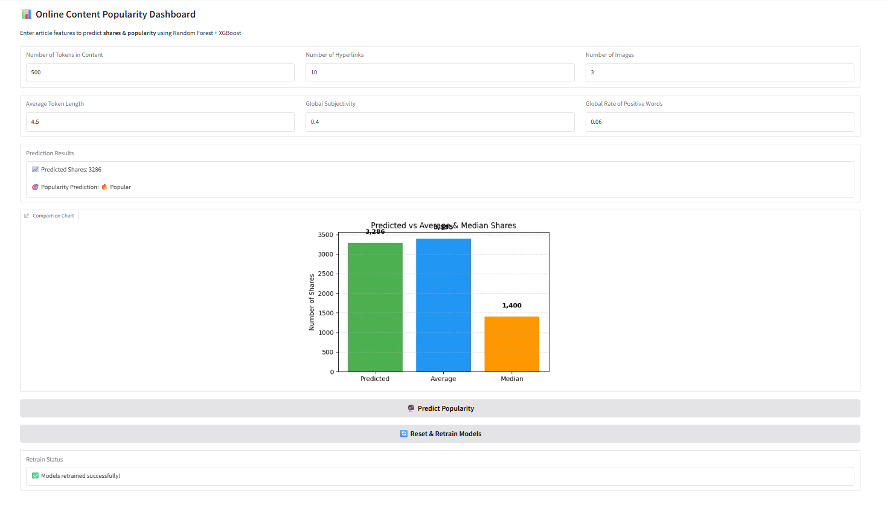

# 📊 Predicting Online Content Popularity

## ✨ Quick Summary

This project predicts the **popularity of online news articles** by:  

- ✅ **Estimating how many times an article will be shared** (Regression)  
- ✅ **Classifying whether an article is Popular 🔥 or Not Popular 📉** (Classification)  
- ✅ **Providing an interactive Gradio dashboard for live predictions**  

It automates **data ingestion → preprocessing → model training → evaluation → deployment**.

## ℹ️ About the Project

The **Online Content Popularity Prediction** project aims to analyze online news articles and determine their **potential popularity**. Using **machine learning models**, it predicts:

* **Continuous popularity** → exact number of shares (regression task)
* **Categorical popularity** → whether the article will be popular or not (classification task)

This helps **content creators, digital marketers, and media companies** make **data-driven decisions** about publishing strategies.

The project follows a **modular approach**, with separate pipelines for:

* **Data ingestion & cleaning**
* **Feature engineering & transformation**
* **Model training & hyperparameter tuning**
* **Deployment as an interactive app**

## 🛠 Tools & Technologies Used

- 🐍 **Python 3.10+**  
- 📊 **Pandas, NumPy** for data processing  
- 🤖 **Scikit-learn, XGBoost, RandomForest** for Machine Learning  
- 📈 **Matplotlib & Seaborn** for data visualization  
- ⚙️ **SMOTE for handling imbalanced classification**  
- 🏗 **Custom ML pipelines** (data ingestion, transformation, training)  
- 🎨 **Gradio** for building an interactive prediction dashboard  
- 📝 **Git & GitHub** for version control  


## 📂 Dataset

* **Name:** Online News Popularity
* **Source:** [UCI Machine Learning Repository](https://archive.ics.uci.edu/ml/datasets/Online+News+Popularity)
* **Rows:** 39,644 | **Columns:** 61
* **Target Variables:**

  * `shares` → total number of shares
  * `popular` → binary label (1 if shares > median, else 0)

**Features include:**

* **Text-related** (token counts, average word length)
* **Multimedia** (images, videos)
* **Sentiment** (subjectivity, polarity)
* **Timing** (weekday publishing)
* **Content categories** (lifestyle, tech, world, etc.)

## 🛠 Workflow  

1. **Data Loading & Cleaning**  
2. **Feature Engineering**  
   - Created a binary popularity label  
   - Applied one-hot encoding for categorical features  
3. **Preprocessing**  
   - Scaling numerical features  
   - Handling imbalance with **SMOTE**  
4. **Exploratory Data Analysis (EDA)**  
   - Visualized feature correlations & distributions  
5. **Model Training**  
   - **Regression Models:** Linear Regression, Random Forest, XGBoost  
   - **Classification Models:** Random Forest Classifier, XGBoost Classifier  
6. **Hyperparameter Tuning**  
   - Used `GridSearchCV` for model optimization  
7. **Deployment**  
   - Built a **Gradio-based interactive prediction dashboard**  


## 🖥 Gradio Dashboard

The interactive **Gradio app** allows you to:  

✅ **Input article features**  
✅ **Get predicted number of shares**  
✅ **Get popularity classification (🔥 Popular / 📉 Not Popular)**  
✅ **Compare predicted shares vs average & median**  


## 📸 Dashboard Preview  

Here’s how the **Online Content Popularity Dashboard** looks:  




## 🔮 Future Improvements

* Add **deep learning models (LSTM, Transformers)**
* Extract **text embeddings** for better NLP features
* Deploy on **Hugging Face Spaces** or **AWS**
* Add **real-time web scraping** for predictions

## Installation

Clone repo & install dependencies:
```bash
git clone https://github.com/Monal0401/online-content-popularity-pred.git
cd online-content-popularity-pred
pip install -r requirements.txt
```

Run the training pipeline:
```bash
python -m src.pipeline.train_pipeline
```

Launch the dashboard:
```bash
python app.py
```

## 📚 References

* [Online News Popularity Dataset](https://archive.ics.uci.edu/ml/datasets/Online+News+Popularity)
* [Scikit-learn Documentation](https://scikit-learn.org/stable/)
* [XGBoost Documentation](https://xgboost.readthedocs.io/)
* [Gradio](https://www.gradio.app/)


## 👤 Author

**Monal**
🔗 [GitHub Profile](https://github.com/Monal0401)


